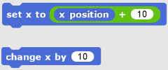
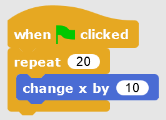
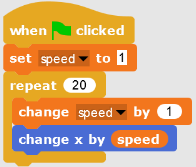
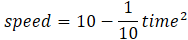

# Moving sprites

There are lots of ways to move in SNAP. When you work on the platform game, your character needs to move left, right, and jump. 
Those movements must be combined so you can jump right or jump left.

Let's review two common ways of moving.

## Absolute position
Some motion blocks tell the sprite **exactly** where to go

If you're using the glide or go to block, remember that you're telling the sprite a specific and final destination. 
This destination can be a number like 120 (what we call a **constant** because it doesn't change) or an expression which 
might include some math.

## Relative position
Some motion blocks tell the sprite how much to change instead of where to go.

In programming, there are often many ways to solve a problem. Sometimes we choose one approach because it's faster to write; 
sometimes another approach is simpler. For example, do the following scripts do the same thing? Which one is easier to understand?
Why?

Questions to ask when programming your platform game:

1. When I press left arrow or right arrow, do I know the exact position of where the sprite is going?
2. When two different scripts move the sprite at the same time, what happens? (For example, space to jump and left arrow to move left)

## Gravity
Gravity is important for making your game feel realistic. Think about what happens in real life: gravity accelerates 
an object toward Earth.1  When you jump off the ground, you eventually slow down and start falling back down. 
If there were no gravity, you'd keep flying off into the universe. You can simulate this by using different values 
when you change your position. Instead of just one "change x by 10" block you might combine several of these to make 
different movements. Try it and see what happens to your sprite.

# Advanced topic: easing functions
NOTE: Don't read until you have finished your game or you're bored!

For those students who already have experience with SNAP and need an extra challenge, you can try animating sprites in your 
world using easing functions. Right now you probably move your sprites using what we call linear easing because the sprite 
doesn't accelerate or decelerate2, it's either moving at a constant speed, or not moving. If you implemented gravity in your 
platform game, you've already made an easing function, you just didn't know it! 

Suppose we want to move our sprite faster and faster. How can we do this? We know there's the change x block:

But this always changes by the same amount. The rate of change3 is 10 steps per loop iteration. We call this linear movement. We can go nonlinear which means the rate of change is actually changing. To do this, we have to change the rate every time our loop runs.

What happens when you run this script? By how much does the sprite move the first time? Can you make it so the sprite speeds up and then slows down?

If you're comfortable with equations, you can even use an easing function to determine how fast you're going (the speed variable above). 

A quadratic easing function uses a quadratic equation (not the quadratic formula!!)  to change the speed as a function of time. Just like you wrote functions like y = x2 in algebra class, we can write a function like:

[Play with this formula online.](http://www.wolframalpha.com/input/?i=plot+s+%3D+10+-+1%2F10+*+t%5E2++when+t+goes+from+0+to+10) When time is 0, what is speed? When (time) does speed become 5? Overall, what is happening to speed over time? Is it slowing down (getting smaller) or speeding up (getting larger)? How would you change the formula to make the opposite effect?

Finally, try making your sprite move by using the easing function in a loop. Hint: you want to change x by the value of the easing function, not change speed by that value.

There are other easing functions like sine waves, sawtooth, etc. You can even see some special effects like [backing](http://gilmoreorless.github.io/sydjs-preso-easing/#cemd-anim-back), [bouncing](http://gilmoreorless.github.io/sydjs-preso-easing/#cemd-anim-bounce), [elasticity](http://gilmoreorless.github.io/sydjs-preso-easing/#cemd-anim-elastic), etc.

Footnotes for science geeks:

1. actually gravity accelerates objects toward each other, but the planets and sun are SO BIG that they are basically the only things that cause enough attractive force. F=ma,  F = Gm1m2/r2
2. deceleration is just negative acceleration. In physics, what does a velocity mean?
3. the rate of change is called the derivative in math & physics speak. Change in x is written dx or ẋ
