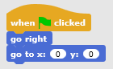
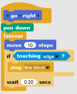

# Stopping

So far you've moved your sprites around, drawn shapes, and even made a game! It's a good time
to reflect on what you've learned. This handout talks about how to stop your scripts. You'll
recognize some of the blocks that you've used already. If you want to make more complex 
behavior, you'll need to understand the differences between them.

## Thinking about stopping

Define "scope": block, script, sprite, all

* Who's the boss? Is my script telling other scripts what to do, or do the other scripts know when to stop on their own? How do they know?
* What's the difference between wait, stop, and pause?

## Blocks that *don't* stop

Some blocks are similar to stop, but they don't really stop your script. They might interrupt 
the script, or pause the script, or even appear to stop (if you use them incorrectly).

Let's first look at the blocks that don't stop, and remember what they do instead.

| Block                       | Description |
|:--------------------------- |:-------------| 
|           |  |
|               |     | 
|  |       |  
|                |

## Blocks that *do* stop

### Blocks that will stop the current script (and more!)

| Block                       | Description |
|:--------------------------- |:-------------| 
|  |  |
|  | |
|  | |

### Blocks that will stop *other* scripts

| Block                       | Description |
|:--------------------------- |:-------------| 
|  |  |
|  |  |
|  |  |

## What do these scripts do?

Suppose you have this script:

I made two different "go right" blocks:
This one moves right and "stop this *block*" when the sprite touches the edge of the canvas.

This one is almost the same except it "stop this *script*" instead.

