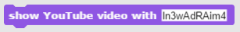
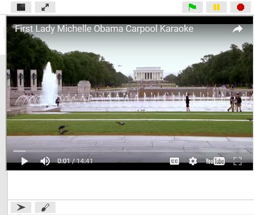

# SNAP blocks for YouTube

Here we provide two blocks for playing YouTube videos in the SNAP canvas. 

The first block, "show YouTube video with (id)", starts playing the YouTube video with the specified ID. 
The block achieves this by using JavaScript to add an `iframe` element on top of the Canvas and setting 
its source to the YouTube embed link. Use "Close YouTube video" and the `iframe` will be removed from
the DOM.

To import this into SNAP, you can use the URL below. The new blocks will be in the Looks palette.

https://raw.githubusercontent.com/danyoel/teals/master/youtube/play-youtube-video.xml

In SNAP, the canvas looks like:

